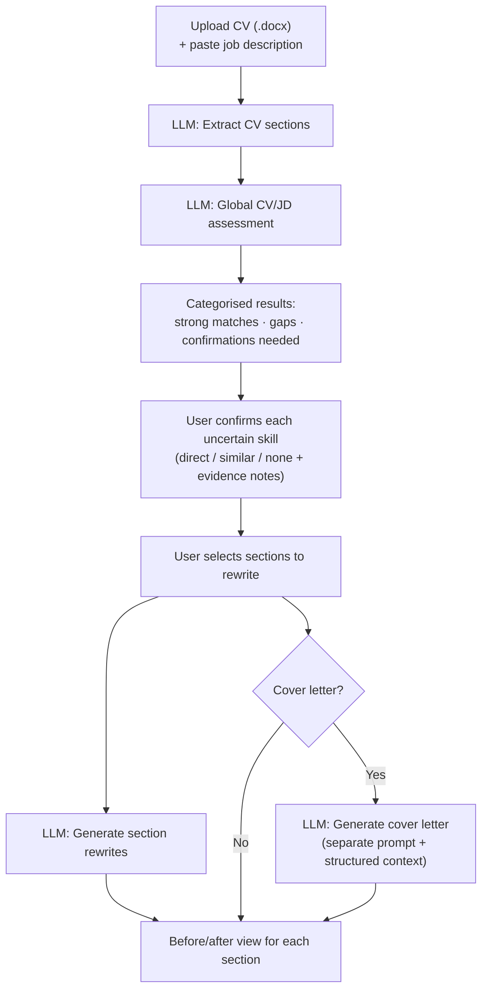

# CV Tailor

An AI-powered CV tailoring tool that analyses your CV against a specific job description, identifies gaps and strengths, and generates targeted section rewrites. It guides you through a structured confirmation flow before producing any content, so the output is grounded in what you can actually evidence — not hallucinated claims.

Built as a personal project to solve a real problem I faced during job applications: adapting CVs honestly and efficiently for specific roles. 

---

## Table of Contents

- [Features](#features)
- [Tech Stack](#tech-stack)
- [Architecture Highlights](#architecture-highlights)
- [AI Workflow](#ai-workflow)
- [Why This Project](#why-this-project)
- [Screenshots](#screenshots)
- [Getting Started](#getting-started)
- [Environment Variables](#environment-variables)
- [Future Improvements](#future-improvements)
- [Engineering Focus](#engineering-focus)

---

## Features

- **CV and job description input** — accepts `.docx CV` uploads and plain-text job descriptions, then extracts structured CV sections and analyses them against the target role.
- **Global CV/JD assessment** — produces a categorised analysis: strong matches, under-emphasised skills, gaps requiring confirmation, and non-actionable gaps
- **Guided confirmation flow** — for each uncertain skill the AI surfaces, you choose one of three answers (direct experience / similar / none), with optional evidence notes; rewrites respect these answers strictly
- **Targeted section rewrites** — select which sections to rewrite; the AI produces a before/after comparison for each one
- **Cover letter generation** — optional; uses a separate prompt and accepts structured context (role title, company name, motivation, location/right-to-work, do-not-mention, etc.)
- **Demo mode** — guests get 2 free AI requests enforced server-side via an `httpOnly` cookie counter; a 3-day cooldown applies after the limit is reached
- **Admin access** — hidden `/admin-login` route; HMAC-signed session token stored in an `httpOnly` cookie; unlimited AI requests
- **Forced demo preview** — admins can visit `/?mode=demo` to view the exact demo user experience without logging out
- **Mock LLM provider** — supports local UI testing without consuming API tokens (`LLM_PROVIDER=mock`)


---

## Tech Stack

**Frontend**
- [Next.js 16](https://nextjs.org) (App Router, server and client components)
- [React 19](https://react.dev)
- [TypeScript 5](https://www.typescriptlang.org)
- [Tailwind CSS 4](https://tailwindcss.com)

**Backend / API**
- Next.js API routes (`/api/assess-cv`, `/api/generate-rewrites`, `/api/admin-login`, `/api/admin-logout`)
- Node.js `crypto` module for HMAC signing and timing-safe token verification

**AI**
- [OpenAI API](https://platform.openai.com) (`gpt-4o` by default)
- Four dedicated LLM functions, each with its own prompt file: section extraction, global assessment, section rewrites, cover letter

**File parsing**
- [mammoth](https://github.com/mwilliamson/mammoth.js) for `.docx` plain-text extraction

---

## Architecture Highlights

### Multi-step state machine
The `useTailorCV` hook drives the entire UI flow through discrete states (`idle → assessing → confirming → generating → done`). Each state transition is explicit and typed, making the flow easy to follow and extend.

### Server component for access control
`app/page.tsx` is an async server component that reads `httpOnly` cookies via `next/headers` before rendering. It derives access state (`isAdmin`, `demoLimitReached`, `isForcedDemoMode`) and passes it as props to the client component — avoiding a client-side fetch and preventing a flash of incorrect UI on load.

### Pluggable LLM provider 
LLM calls are isolated behind provider-specific functions (`extractCVSections`, `assessCVGlobally`, `generateSectionRewrites`, `generateCoverLetter`) for CV section extraction, global assessment, section rewrites, and cover letter generation. This keeps prompt logic separated from UI logic and makes the AI layer easier to test, replace, or extend. A mock provider is available for local development, allowing the full user flow to be tested without making real API calls.

### Stateless admin sessions
Admin authentication uses an HMAC-SHA256 signed token (`admin.<hex-signature>`) stored in an `httpOnly; SameSite=Strict` cookie. No server-side session store or database is needed — validity is verified by recomputing the HMAC on each request. Timing-safe comparison (`crypto.timingSafeEqual`) protects against side-channel attacks.

### Demo counter
Guest usage is tracked with a small JSON object `{ count, firstUsed }` stored in a server-set `httpOnly` cookie. JavaScript cannot read or modify it. The counter auto-resets after the 3-day TTL, and the check logic lives entirely in `lib/auth/session.ts`.

### Separation of LLM concerns
CV section rewrites and cover letter generation use entirely separate prompts and LLM functions. This avoids mixing CV-writing rules (evidence-based, concise) with cover-letter rules (narrative tone, motivation handling, company context).

### Reusable component library
The UI is built from a small set of typed primitives: `Button` (primary / secondary / ghost variants), `AlertBanner` (amber / red), `TextInput`, `Textarea`, and `FormField`. All form inputs across the app use these components, making visual consistency easy to maintain.

---

## AI Workflow



---

## Why This Project

Job seekers often apply with generic CVs that fail to surface relevant experience for a specific role. CV Tailor addresses this by treating the tailoring process as a structured, evidence-driven workflow rather than a freeform editing task. The AI identifies what to emphasise, surfaces gaps that need clarification, and generates rewrites only after the candidate has confirmed what they can honestly claim.

---

## Screenshots

> Screenshots coming soon.

| Screen | Description |
|---|---|
| Home / upload | CV upload and job description input |
| Global assessment | Strengths, gaps, and confirmation items |
| Confirmation flow | Per-skill answer with evidence notes |
| Section rewrites | Before/after comparison for each section |
| Cover letter | Generated cover letter with structured context |

---

## Getting Started

### 1. Install dependencies

```bash
npm install
```

### 2. Configure environment variables

Copy `.env.example` to `.env.local` and fill in the required values:

```bash
cp .env.example .env.local
```

See [Environment Variables](#environment-variables) below.

### 3. Run locally

```bash
npm run dev
```

Open [http://localhost:3000](http://localhost:3000).

### 4. Build for production

```bash
npm run build
npm run start
```

---

## Environment Variables

| Variable | Required | Description |
|---|---|---|
| `OPENAI_API_KEY` | Yes (unless using mock) | Your OpenAI API key |
| `OPENAI_MODEL` | No | Model to use; defaults to `gpt-4o` |
| `LLM_PROVIDER` | No | `openai` by default, or `mock` |
| `ADMIN_PASSWORD` | Yes | Password for the hidden `/admin-login` route |
| `ADMIN_SESSION_SECRET` | Yes | Random string (min 32 chars) used to sign admin session tokens |

For local development without using API credits, set `LLM_PROVIDER=mock`. This runs the full UI flow with mock AI responses.

---

## Future Improvements

- PDF upload support
- Persist tailoring sessions so users can return to previous results
- More LLM provider options (e.g. local models via Ollama)
- Automated tests (unit tests for auth logic, integration tests for API routes)
- Accessibility audit and improvements
- Metrics / admin dashboard (usage stats, latency, token counts)
- Deployment configuration and CI/CD pipeline

---

## Engineering Focus

This project focuses on building a practical, evidence-based AI workflow with strong product UX, type-safe application architecture, reusable UI patterns, and server-side access control.
